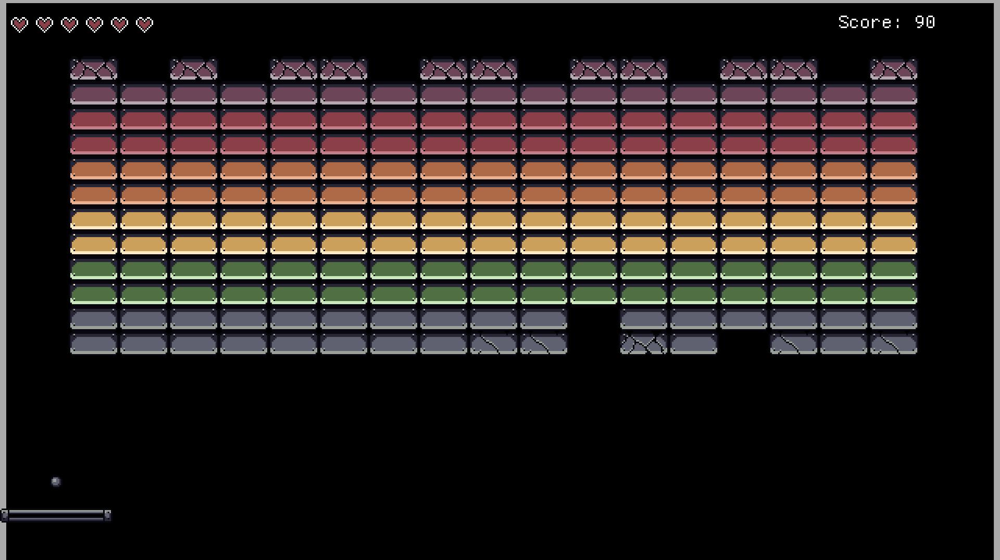

# YABOC! (Yet Another Breakout Clone)

Another simple GoDot project to help me learn the basics. This time a clone of the classic: "Breakout!" This is part of the [20 games challenge](https://20_games_challenge.gitlab.io/).

## Screenshot

## Legal Stuff

All assets were either created by myself, or will have their attribution below. If I am using your work and you do not want me to, please reach out and I will remove it! Where possible I will attribute the artists, even when not explicitly requested.

Title Track: Retro Disco Synthwave by Night Patrol

Track 1: Synthwave Upbeat Retro by Streets

Track 2: Indie Melancholic Electronic by Disruption

Track 3: Retro Games Music The Road

Track 4: Dark Synthwave by Singularity

Track 5: Retro Space Synthwave by MokkaMusic / Apollo

### TODOs

- Update title art asset
- Upgrade menus and settings to be persistent
- Overhaul/refactor the entire code base
- Bring in my own custom assets
- Shaders
